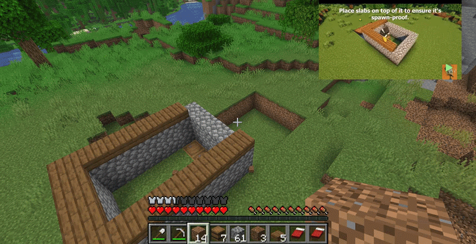

# PlayLayer
Watch tutorials or videos while gaming — without alt-tabbing.


## Hotkeys
- Ctrl+Alt+C = Guide
- Ctrl+Alt+O = Toggle overlay
- Ctrl+Alt+P = Pause/Play
- Ctrl+Alt+S = Search mode
- Ctrl+Alt+H = Home
- Ctrl+Alt+K = -10s
- Ctrl+Alt+L = +10s

## Download
Download the latest Windows build from GitHub Releases.

## Build

```bash
dotnet build OverlayTutorial.sln
```

## Run

```bash
dotnet run --project OverlayTutorial/OverlayTutorial.csproj
```
